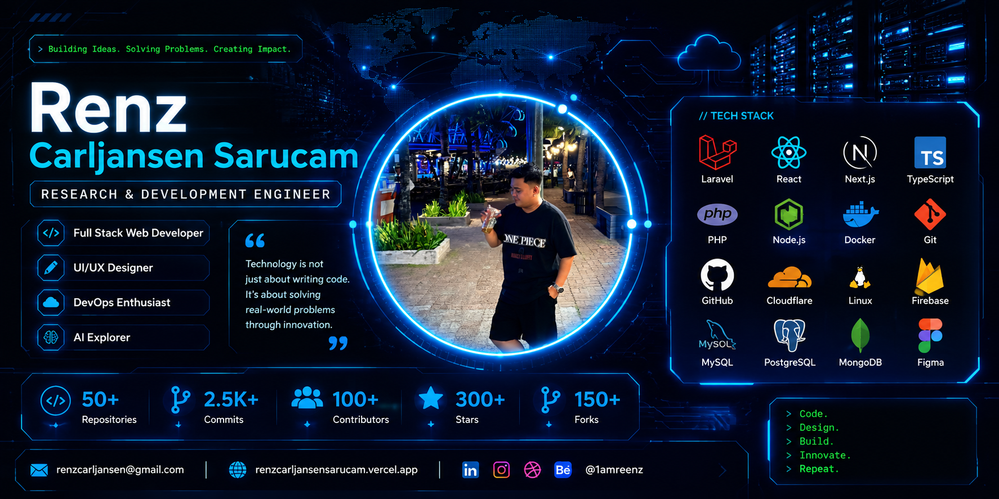

<div align="center">



# 👋 Hi, I'm Renz Carljansen Sarucam

### 🚀 Research & Development Engineer • Full Stack Web Developer • UI/UX Designer


</div>

---

# 👨‍💻 About Me

```yaml
Name: Renz Carljansen Sarucam

Role:
  - Research & Development Engineer
  - Full Stack Web Developer
  - UI/UX Designer

Current Focus:
  - Enterprise Laravel Applications
  - React & Next.js
  - AI Integration
  - Cloudflare Tunnel
  - Docker & DevOps

Currently Learning:
  - React Native
  - Kubernetes
  - Artificial Intelligence
  - Cloud Computing
  - CI/CD

Looking For:
  - Open Source Collaboration
  - Enterprise Web Projects
  - UI / UX Projects
```

---

# 🛠 Tech Stack

### 💻 Programming Languages

<p>


</p>

### ⚛️ Frontend

<p>


</p>

### 🛠 Backend

<p>


</p>

### 🗄 Database

<p>


</p>

### ☁️ DevOps & Cloud

<p>


</p>

### 🎨 Design Tools

<p>


</p>

---

# 🚀 Current Technologies

| Backend | Frontend | DevOps | Database |
|----------|----------|---------|----------|
| Laravel | React | Docker | MySQL |
| PHP | Next.js | Linux | PostgreSQL |
| Firebase | Vue | GitHub Actions | MongoDB |


---


# 📌 Featured Projects

| Project | Description | Technologies |
|----------|-------------|--------------|
| 🚀 **ReOrderPro** | Procurement Management System | Laravel, MySQL |
| 🏢 **E-JO** | Enterprise Job Order Management | Laravel |
| 🌐 **Portfolio Website** | Personal Portfolio | Next.js |
| 🤖 **AI Assistant** | AI-powered Assistant | OpenAI API |

> Replace these with your actual repository links after pinning them on GitHub.

---

# 🌱 Currently Learning

- ⚛️ React Native
- ☸️ Kubernetes
- 🤖 Artificial Intelligence
- ☁️ Cloud Computing
- 🔄 CI/CD Pipelines
- ⚙️ DevOps Automation

---

# 📬 Contact

📧 **Email**

**renzcarljansen@gmail.com**

🌐 **Portfolio**

**https://renzcarljansensarucam.vercel.app/**

💼 **LinkedIn**

**https://www.linkedin.com/in/renz-carljansen-sarucam-195897314/**

---

# 💡 Favorite Quote

> *"Technology is not just about writing code. It's about solving real-world problems through innovation."*

---

<div align="center">

### ⭐ Thank you for visiting my GitHub Profile!


</div>
